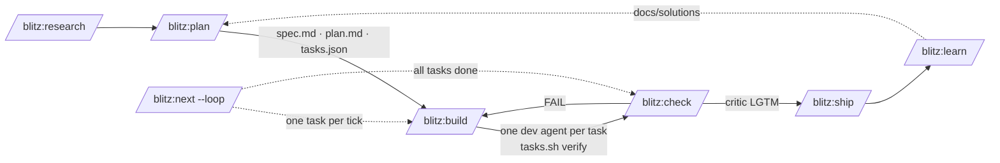

<div align="center">

```
██████╗ ██╗     ██╗████████╗███████╗
██╔══██╗██║     ██║╚══██╔══╝╚══███╔╝
██████╔╝██║     ██║   ██║     ███╔╝ 
██╔══██╗██║     ██║   ██║    ███╔╝  
██████╔╝███████╗██║   ██║   ███████╗
╚═════╝ ╚══════╝╚═╝   ╚═╝   ╚══════╝
```

**⚡ An agentic development loop for Claude Code, tuned for Vue/Nuxt + Firebase ⚡**

research → plan → build → check → ship · structural "done" · anti-shortcut hooks · fresh-context critic

[](https://opensource.org/licenses/MIT)
[](https://code.claude.com/docs/en/plugins)
[](https://github.com/lasswellt/blitz-cc/releases)

</div>

---

## What is Blitz?

Blitz turns Claude Code into a development loop that can run unattended without lying to you about what it finished. A plan is a JSON feature list with a `passes` bit per task; a task is done only when its verify commands ran and passed; the file that records that cannot be hand-edited; a critic with no write access and no memory of the build has to sign off before anything reaches PASS. Everything else in the plugin exists to keep those four facts true while Claude works.



Design choices, and the evidence behind them, are in [`docs/reviews/2026-09-19_v3-agentic-restructure/`](docs/reviews/2026-09-19_v3-agentic-restructure/README.md):

- **One task per fresh context.** `build` spawns one `dev` agent per task and gives it only the task, its files, and the never-edit list. Parallel waves are opt-in and only over tasks with disjoint files.
- **Tests are not the only signal.** Every task carries at least one non-test verify command (grep, shell, e2e) beside its test command, because every frontier model saturates visible tests while failing held-out ones.
- **Done is structural.** Only `scripts/tasks.sh` writes `tasks.json`; a `PreToolUse` hook denies every other path. A Stop-hook gate refuses to end a build turn until type-check and the selected tests pass.
- **Persistent state is treated as memory.** `tasks.json` and `docs/solutions/` drive later work, so they are schema-checked and injection-scanned at session start and carry an `origin`.
- **A kill switch.** `touch .cc-sessions/STOP` denies every tool call until removed.

---

## Quick Start

```
/plugin marketplace add lasswellt/blitz-cc
/plugin install blitz@blitz
```

Pin the version you install and leave auto-update off for plugins that run hooks; review the diff before upgrading. Local development: `claude --plugin-dir ./blitz-cc` then `/reload-plugins`.

```bash
/blitz:doctor                      # plugin, session state, and project setup; prints Overall: HEALTHY
/blitz:onboard                     # map an existing codebase, write CLAUDE.md and the stack profile
/blitz:plan "add a health endpoint" # spec.md, plan.md, tasks.json under docs/plans/<slug>/
/blitz:build health-endpoint       # next open task, fresh dev agent, verify gate
/blitz:check --scope plan health-endpoint --fix
/blitz:ship --plan health-endpoint # slash-only: version, changelog, tag, archive the plan
/blitz:next --loop                 # or let the loop pick the next tick itself
```

**Prerequisites:** Claude Code ≥ 2.1.271 (floors in `.claude-plugin/compat.json`), bash, Node.js ≥ 18, python3, jq. Hooks run through bash: on native Windows install Git Bash or use WSL, or the guards fail open. Optional: Playwright MCP for `browse`, `ui-build`, `ui-audit`; Gemini CLI for the cross-model critic; the `claude-security` plugin for verified security findings.

## Supported Stacks

| Layer | Supported |
|---|---|
| Frameworks | Vue 3 (Vite), Nuxt 3 |
| UI | Tailwind, Quasar, Vuetify (auto-detected) |
| Backend | Firebase / GCP, Cloud Functions v2, Firestore rules |
| State | Pinia, VueFire |
| Testing | Vitest, Jest, Playwright, Firebase emulators |
| Workspaces | pnpm, Nx, Turborepo |

`scripts/detect-stack.sh` runs where a skill needs the stack profile and caches to `.cc-sessions/stack-profile.cache` for an hour.

---

## The Loop

| Skill | Does | Writes |
|---|---|---|
| `research` | parallel investigators plus a citation critic; `--codebase` answers "how does this repo do X" read-only | `docs/research/` |
| `plan` | classifies the ask (spike, bounded, architectural), interviews unless `--autonomous`, reads `docs/solutions/` and `BACKLOG.md`, emits tasks with verify commands per stack | `docs/plans/<slug>/{spec,plan,progress}.md`, `tasks.json` |
| `build` | inline for a one-sentence change; otherwise one `dev` per task, fix rounds ≤3 then a fresh opus agent, circuit breaker at 3 attempts; `--parallel` waves; `--issue N` | code, `progress.md`, task state via `tasks.sh` |
| `check` | tsc, lint, full tests, build, registry detectors, test-impact analysis, anti-mock, `tasks.sh verify` per task, critic survey then adversarial critic; `--fix`, `--comment` (PR inline comments), `--security` | `check-report.md` |
| `next` | deterministic Observe (`scripts/next-state.sh`), one row, one dispatch; `--loop` is headless-safe and ends with `LOOP_DONE` | commits with a `Task:` trailer |
| `ship` | slash-only, pinned model: gates, version, changelog, tag, archive the plan, run `learn` | release commit, `docs/plans/archive/` |
| `learn` | mines rulings, check reports, and `Task:` commits into reusable solutions | `docs/solutions/<slug>.md` |

`next --loop` rows, in tie-break order: inbox pending or a session waiting for input → `LOOP_DEFER`; a task blocked on a spec question → `LOOP_ESCALATE` (channel reply, push notification, or inbox); open work → `build`; all tasks done and no fresh PASS → `check`; PASS → mark done, `learn`, archive, print `Ready: /blitz:ship`; nothing open → `LOOP_DONE`. Run it under `/loop`, a Routine, or `claude -p` with a fresh session per tick; `doctor --loop-md` writes the `.claude/loop.md` that makes bare `/loop` do this.

The rest of the catalog (`audit`, `refactor`, `migrate`, `test-gen`, `doc-gen`, `dep-health`, `perf-profile`, `browse`, `ui-build`, `ui-audit`, `onboard`, `sessions`, `todo`, `doctor`) is generated from frontmatter into [`docs/CATALOG.md`](docs/CATALOG.md).

## Structural "done"

```jsonc
// docs/plans/<slug>/tasks.json — written only by scripts/tasks.sh
{ "id": "T-003", "title": "GET /health handler", "role": "backend",
  "files": ["src/server/health.ts"], "depends_on": ["T-001"],
  "verify": [
    { "cmd": "npx vitest run src/server/health.test.ts --reporter=dot", "timeout": 300 },
    { "cmd": "! grep -nE 'TODO|return \\{\\}' src/server/health.ts", "timeout": 10 }
  ],
  "passes": false, "status": "open", "blocked_reason": null, "attempts": 0,
  "last_verify": { "ts": "", "ok": false, "failed": "", "tail": "" }, "origin": "plan", "notes": "" }
```

- `tasks.sh add` refuses an empty `verify[]` and a test-only `verify[]` unless `--test-only-ok` is stated.
- `tasks.sh verify` runs the commands under `timeout`, records a 200-char evidence tail, and is the only path to `status: done`.
- `hooks/scripts/tasks-guard.sh` denies `Write`, `Edit`, and shell writes to `docs/plans/*/tasks.json`; `startup-validate.sh` quarantines a malformed or injected task file before it is read.
- Dev agents never see `tasks.json` or `progress.md` as editable; both are updated on the main thread at task boundaries.

## Anti-shortcut hooks

Six `PreToolUse` guards and one `PostToolUse` type-check ratchet stop the shortcuts an autonomous coder reaches for, at the tool boundary, each with a logged override: `--no-verify`, destructive git on a dirty tree, destructive SQL outside a migration, test deletion, `as any` insertion, test disabling, type-error regression. Two more protect the loop's state: `tasks-guard.sh` and `kill-switch.sh`. Command guards match `Bash|PowerShell`.

## Critics

`critic --mode reject` is the gate: opus, fresh context, `omitClaudeMd`, no Write or Edit, looking for one reason to REJECT on the final diff. `critic --mode survey` is the lens (spec compliance first, then code quality) that `check` fans out before the gate. `research-critic` verifies citations; `design-critic` judges UI through Playwright. Set `BLITZ_USE_GEMINI_CRITIC=1` to route the reject critic through Gemini, or `BLITZ_DUAL_CRITIC=1` to require both.

## How check and audit share one registry

`skills/_shared/check-registry.json` holds every detector: a deterministic lane (grep, AST, tsc, git, import graph) whose findings may flip a verdict, and a semantic lane whose findings only annotate. `check` is precision-biased and runs on every diff; `audit` is recall-biased, runs before a release, aggregates independent passes, refutes each finding in a panel, and emits its survivors as `docs/plans/audit-<date>/tasks.json` so the loop can work them. `doctor --review-md` exports the P0/P1 rows as a `REVIEW.md` for hosted Claude Code Review.

## CI and hosted review

`doctor --ci` writes `.github/workflows/blitz-check.yml`: `claude-code-action` with the plugin installed runs `/blitz:check --scope diff --comment` on every pull request and posts inline comments through the GitHub inline-comment tool. The plugin's own CI runs the validators, the bats suite, `gen-catalog.sh --check`, and, when an API key is present, the advisory `claude plugin eval` suite in `evals/`.

---

## Architecture

```
blitz-cc/
├── .claude-plugin/        plugin.json · marketplace.json · compat.json (version floors)
├── skills/<name>/         SKILL.md (+ references/, assets/), auto-discovered as /blitz:<name>
├── skills/_shared/        loop.md · sessions.md · agents.md · quality.md · security.md · output.md
│                          check-registry.json · design-criteria.md
├── agents/                dev · critic · test-writer · research-critic · design-critic
├── hooks/hooks.json       event wiring; hooks/scripts/ (README.md is the index); hooks/tests/ (bats)
├── scripts/               tasks.sh · next-state.sh · gen-catalog.sh · gen-review-md.sh · detect-stack.sh · validators
├── workflows/             build-wave.js · review-fanout.js · audit-sweep.js
├── templates/             blitz-check.yml · loop.md (written by doctor)
├── evals/                 claude plugin eval cases
└── output-styles/         terse-technical.md (forced while the plugin is enabled)
```

Runtime artifacts a project keeps: `docs/plans/<slug>/` (tracked), `docs/solutions/` (tracked), `docs/plans/BACKLOG.md` (tracked), `.cc-sessions/` (gitignored: session records, inbox, activity feed, `HANDOFF.json`, `ratchet.json`, test journal, `STOP`).

## Hooks

Hooks are the enforcement layer: they fire on tool calls the model cannot talk its way past. Beyond the guards above they format, lint, and run impacted tests after edits, arm and check the Stop gate, record session start and end, write `HANDOFF.json` before compaction (plan, task, gate path, never-edit list), validate frontmatter and links on commit, and log notifications and permission denials to the inbox. The index grouped by event is [`hooks/scripts/README.md`](hooks/scripts/README.md); the authoring contract is `.claude/rules/hooks.md`.

Environment flags read by the scripts: `BLITZ_OVERRIDE_NO_VERIFY`, `BLITZ_DISABLE_TYPECHECK_BLOCK`, `BLITZ_DISABLE_TEST_DISABLING_BLOCK`, `BLITZ_DISABLE_AS_ANY_BLOCK`, `BLITZ_TASKS_GUARD_OFF`, `BLITZ_TIA_DISABLE`, `BLITZ_ALLOW_WORKTREE_COLLISION`, `BLITZ_SKIP_BRANCH_CLEANUP`, `BLITZ_GEMINI_BIN`, `BLITZ_GEMINI_MODEL`, `BLITZ_GEMINI_FLAGS`. Flags read by skills: `BLITZ_DISPATCH` (auto, workflow, agent), `BLITZ_USE_GEMINI_CRITIC`, `BLITZ_DUAL_CRITIC`, `BLITZ_REVIEW_SEQUENTIAL`.

## Shared protocols

One file per concern under `skills/_shared/`: `loop.md` (artifacts, `tasks.json` schema, `next` rows, gates, `/loop`, Routines, Projects), `sessions.md` (records, inbox, mailbox, conflict matrix, messaging), `agents.md` (roster, spawn spec, status enum, fix rounds, parallelism policy, worktrees), `quality.md` (definition of done, registry, ratchet, verification stack), `security.md` (trust boundaries TB-1 to TB-5, memory poisoning, kill switch, supply chain), `output.md` (terse output, feed and inbox line schemas).

## Contributing

Run the validators before committing; the pre-commit hook runs them again: `hooks/scripts/skill-frontmatter-validate.sh --all`, `hooks/scripts/agent-frontmatter-validate.sh --all`, `hooks/scripts/markdown-link-validate.sh --all`, `scripts/validate-plugin-structure.sh`, `scripts/check-version-sync.sh`, `scripts/gen-catalog.sh --check`, `bats hooks/tests/`. Skill and agent authoring rules live in `.claude/rules/skills.md`. After every model release, run the eval suite with and without the plugin and retire any piece whose contribution has gone to zero.

## Acknowledgments

The clarification-gate principles are adapted from [multica-ai/andrej-karpathy-skills](https://github.com/multica-ai/andrej-karpathy-skills) (MIT). Effectiveness research behind the two-lane registry is cited in `docs/consolidation/review-audit/effectiveness-research.md`; the sources behind the v3 loop are in `docs/reviews/2026-09-19_v3-agentic-restructure/sources.md`.

## License

MIT — see [LICENSE](LICENSE).
