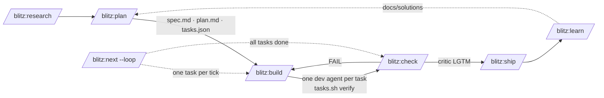

<div align="center">

```
██████╗ ██╗     ██╗████████╗███████╗
██╔══██╗██║     ██║╚══██╔══╝╚══███╔╝
██████╔╝██║     ██║   ██║     ███╔╝ 
██╔══██╗██║     ██║   ██║    ███╔╝  
██████╔╝███████╗██║   ██║   ███████╗
╚═════╝ ╚══════╝╚═╝   ╚═╝   ╚══════╝
```

**⚡ A language-agnostic agentic development loop for Claude Code ⚡**

research → plan → build → check → ship · structural "done" · anti-shortcut hooks · fresh-context critic

[](https://opensource.org/licenses/MIT)
[](https://code.claude.com/docs/en/plugins)
[](https://github.com/lasswellt/blitz-cc/releases)

</div>

---

## The problem this solves

An agent left to work unattended will report success it did not earn. It writes the test that passes, stubs the function the test calls, marks the task complete, and tells you it is done. Nothing in the transcript is false exactly — it just isn't evidence.

Blitz replaces self-report with structure. Four invariants hold while Claude works, and every skill, hook and script in this plugin exists to keep them true:

| Invariant | Enforced by |
|---|---|
| A task is done only when its verify commands exited 0 | `scripts/tasks.sh` is the only writer of `status: done` |
| The record of what passed cannot be hand-edited | `tasks-guard.sh` denies `Write`, `Edit` and shell writes to `tasks.json` |
| Tests are never the only evidence | `tasks.sh add` refuses an empty or test-only `verify[]` |
| Nothing reaches PASS without an adversarial read | the `critic` agent: fresh context, no write tools, looking for one reason to reject |

The rest is consequence. Dev agents get one task each and never see the ledger. A Stop hook refuses to end a build turn while the type-check fails. `touch .cc-sessions/STOP` denies every tool call until you remove it.

Design decisions and the evidence behind them: [`docs/reviews/2026-09-19_v3-agentic-restructure/`](docs/reviews/2026-09-19_v3-agentic-restructure/README.md).

---

## Install

```
/plugin marketplace add lasswellt/blitz-cc
/plugin install blitz@blitz
```

Pin the version and leave auto-update off for any plugin that runs hooks; read the diff before upgrading. For local development: `claude --plugin-dir ./blitz-cc`, then `/reload-plugins`.

**Requires** Claude Code ≥ 2.1.271 (floors are authoritative in `.claude-plugin/compat.json`), bash, Node.js ≥ 18, python3 and jq. Hooks execute through bash, so native Windows needs Git Bash or WSL — without one the guards fail open. Optional: Playwright MCP for the browser skills, the Gemini CLI for a cross-model critic, the `claude-security` plugin for verified security findings.

```bash
/blitz:doctor                       # plugin, session state, project setup → Overall: HEALTHY
/blitz:onboard                      # map an existing repo, write CLAUDE.md and the stack profile
/blitz:plan "add a health endpoint" # → docs/plans/health-endpoint/{spec,plan,progress}.md + tasks.json
/blitz:build health-endpoint        # next open task, fresh dev agent, verify gate
/blitz:check --scope plan health-endpoint --fix
/blitz:ship --plan health-endpoint  # slash-only: version, changelog, tag, archive
/blitz:next --loop                  # or hand the wheel over and let it pick each tick
```

---

## The loop



| Skill | What it does | What it writes |
|---|---|---|
| `research` | parallel investigators plus a citation critic; `--codebase` answers "how does this repo do X" without writing | `docs/research/` |
| `plan` | classifies the ask (spike, bounded, architectural), interviews unless `--autonomous`, mines `docs/solutions/` and the backlog, emits tasks carrying verify commands for the detected stack | `docs/plans/<slug>/` |
| `build` | inline for a one-sentence change; otherwise one `dev` agent per task, fix rounds capped then escalated to a fresh opus agent, circuit breaker at three attempts, opt-in `--parallel` waves, `--issue N` | code, `progress.md`, task state via `tasks.sh` |
| `check` | typecheck, lint, tests, build, registry detectors, test-impact analysis, anti-mock, `tasks.sh verify` per task, a critic survey and then the adversarial gate; `--fix`, `--comment`, `--security` | `check-report.md` |
| `next` | deterministic observation via `scripts/next-state.sh`, one row, one dispatch; `--loop` is headless-safe | commits carrying a `Task:` trailer |
| `ship` | slash-only, pinned model: gates, version, changelog, tag, archive, then `learn` | release commit, `docs/plans/archive/` |
| `learn` | mines rulings, check reports and `Task:` commits into reusable solutions | `docs/solutions/<slug>.md` |

Everything else — `audit`, `refactor`, `migrate`, `test-gen`, `doc-gen`, `dep-health`, `perf-profile`, `browse`, `ui-build`, `ui-audit`, `onboard`, `sessions`, `todo`, `doctor` — is generated from frontmatter into [`docs/CATALOG.md`](docs/CATALOG.md), which is the only inventory that cannot drift.

### Unattended ticks

`next` reads the world with a script, not a vibe, then takes the lowest row that matches:

| # | Condition | `--loop` does |
|---|---|---|
| 0 | kill switch, inbox pending after triage, or a session waiting on input | `LOOP_DEFER` |
| 1 | a task blocked on a spec question the model cannot answer | notify, then `LOOP_ESCALATE` |
| 2 | an `in_progress` task, or an `open` task whose dependencies are `done` | dispatch `build` |
| 3 | every task `done`, check report stale | dispatch `check` |
| 4 | check report PASS and fresh | mark done, run `learn`, archive, print `Ready: /blitz:ship` |
| 5 | nothing open | `LOOP_DONE` |

Row 4 stops at the ready line on purpose: `ship` is slash-only, so a scheduled fire cannot release anything. Run the loop under `/loop`, a cloud Routine, or `claude -p` with a fresh session per tick; `doctor --loop-md` writes the `.claude/loop.md` that makes a bare `/loop` do this.

---

## Structural "done"

```jsonc
// docs/plans/<slug>/tasks.json — written only by scripts/tasks.sh
{ "id": "T-003", "title": "GET /health handler", "role": "backend",
  "files": ["src/server/health.ts"], "depends_on": ["T-001"],
  "verify": [
    { "cmd": "npx vitest run src/server/health.test.ts --reporter=dot", "timeout": 300 },
    { "cmd": "! grep -nE 'TODO|return \\{\\}' src/server/health.ts", "timeout": 10 }
  ],
  "passes": false, "status": "open", "blocked_reason": null, "attempts": 0,
  "last_verify": { "ts": "", "ok": false, "failed": "", "tail": "" }, "origin": "plan", "notes": "" }
```

The second verify command is the point. Every frontier model saturates the tests it can see while failing held-out ones, so each task carries at least one non-test check — a grep, a shell assertion, an e2e run — beside its test command. `tasks.sh verify` runs them under `timeout`, records a truncated evidence tail, and is the only path to `status: done`.

Persistent state is treated as memory, because it is: `tasks.json` and `docs/solutions/` steer later work, so they carry an `origin`, are schema-checked and injection-scanned at session start, and a malformed or poisoned task file is quarantined before anything reads it.

---

## The enforcement layer

Hooks fire at the tool boundary, where argument beats none. Each guard below blocks the call and logs an override path rather than arguing in prose.

| Event | What runs |
|---|---|
| `PreToolUse` | kill switch · `tasks.json` guard · `--no-verify` · destructive git on a dirty tree · destructive SQL outside a migration · test deletion · `as any` insertion · test disabling · commit-time validators |
| `PostToolUse` | format · impacted tests · skill and agent frontmatter · the type-error ratchet |
| `Stop` / `StopFailure` | the gate: a build turn cannot end while its typecheck or selected tests fail |
| `SessionStart` / `SessionEnd` | session records, activity feed, startup validation and quarantine |
| `PreCompact` | `HANDOFF.json` — plan, task, gate path, never-edit list |
| `SubagentStart` | the spawn invariant, byte-identical for every dev and critic agent |
| `Notification` / `PermissionDenied` / `ConfigChange` / `WorktreeRemove` | inbox lines and cleanup |

The index grouped by event is [`hooks/scripts/README.md`](hooks/scripts/README.md); the authoring contract is `.claude/rules/hooks.md`; the bats suite under `hooks/tests/` covers each guard's block, its pass-through and its escape hatch.

### Critics

`critic --mode reject` is the gate: opus, fresh context, `omitClaudeMd`, no write tools, reading the final diff for one reason to reject. `critic --mode survey` is the lens `check` fans out first — spec compliance before code quality. `research-critic` verifies citations; `design-critic` judges UI through Playwright. `BLITZ_USE_GEMINI_CRITIC=1` routes the reject critic through Gemini; `BLITZ_DUAL_CRITIC=1` demands both models agree.

### One registry, two lanes

`skills/_shared/check-registry.json` holds every detector once. The deterministic lane (grep, AST, tsc, git, import graph) may flip a verdict; the semantic lane only annotates. `check` is precision-biased and runs on every diff. `audit` is recall-biased, runs before a release, aggregates independent passes, refutes each finding in a panel, and emits the survivors as a plan the loop can work. `doctor --review-md` exports the P0/P1 rows for hosted Claude Code Review.

---

## Polyglot by data, not by code

The loop is language-neutral: a plan is JSON, a verify command is a shell command, and "done" is an exit code. Only the tooling varies, and that lives in a table — `templates/toolchain.default.json`. Adding a language means adding rows, never editing a script.

| Stack | Detected by | Format | Lint | Typecheck (ratchet) |
|---|---|---|---|---|
| Node / TypeScript | `package.json`, `tsconfig.json` | prettier, biome | eslint, biome | `tsc`, `vue-tsc` |
| Python | `pyproject.toml`, `setup.cfg`, `requirements.txt` | ruff, black | ruff, flake8 | mypy, pyright |
| Rust | `Cargo.toml` | rustfmt | clippy | `cargo check` |
| Go | `go.mod` | gofmt | `go vet` | `go build` |
| JVM | `pom.xml`, `build.gradle` | spotless | — | gradle |
| Ruby | `Gemfile` | rubocop | rubocop | — |
| .NET | `*.csproj`, `*.sln` | `dotnet format` | — | `dotnet build` |
| Deno, PHP, Elixir, Swift | `deno.json`, `composer.json`, `mix.exs`, `Package.swift` | see the table | | |

A row fires only when its marker is present, its config exists and its tool answers a probe, so a missing tool is a silent skip rather than a red build. `scripts/toolchain.sh explain` prints what resolves here; `/blitz:doctor` flags a stack with no typecheck row, because that stack has no ratchet.

Override at your repo root with `.blitz-toolchain.json`:

```json
{ "disable": ["python-ruff"], "prefer": { "format": ["python-black"] } }
```

`disable` drops rows by id, `prefer` reorders a lane. Neither can supply a `cmd`: a checkout is untrusted inbound data ([security.md](skills/_shared/security.md), TB-1), and an argv read from repo content would be arbitrary execution on every edit.

**Framework depth.** Beyond the language lanes, blitz ships deeper support for Vue 3 / Nuxt 3 / Firebase — adapter detection for Tailwind, Quasar and Vuetify, Firestore rules and Cloud Functions conventions, and the design-quality lanes behind `ui-build` and `ui-audit`. Those registry rows are tagged `stacks: ["node"]`, so a Go or Python repo never runs them.

**Code intelligence.** `.lsp.json` wires language servers for TypeScript, Python, Rust and Go, giving Claude `goToDefinition`, `findReferences` and workspace symbol search instead of grep-and-read-the-whole-file. You install the binaries; each path is a `/config` option you can repoint or clear. Two caveats: plugin language servers do not start in cloud sessions, and when two enabled plugins claim the same extension, the first registered wins.

---

## Layout

```
blitz-cc/
├── .claude-plugin/        plugin.json · marketplace.json · compat.json (version floors)
├── skills/<name>/         SKILL.md (+ references/, assets/) — auto-discovered as /blitz:<name>
├── skills/_shared/        loop · sessions · agents · quality · security · output protocols
│                          check-registry.json · design-criteria.md
├── agents/                dev · critic · test-writer · research-critic · design-critic
├── hooks/                 hooks.json (event wiring) · scripts/ (README.md indexes them) · tests/ (bats)
├── scripts/               tasks.sh · next-state.sh · toolchain.sh · detect-stack.sh · gen-catalog.sh · validators
├── workflows/             build-wave · review-fanout · audit-sweep
├── templates/             blitz-check.yml · loop.md · toolchain.default.json
├── evals/                 claude plugin eval cases
└── output-styles/         terse-technical.md (forced while the plugin is enabled)
```

A project using blitz keeps `docs/plans/<slug>/`, `docs/solutions/` and `docs/plans/BACKLOG.md` in git, and `.cc-sessions/` out of it — session records, inbox, activity feed, `HANDOFF.json`, the ratchet baseline, the test journal, and `STOP`.

Each shared protocol is one file per concern: `loop.md` (artifacts, task schema, decision rows, gates), `sessions.md` (records, inbox, mailbox, conflict matrix), `agents.md` (roster, spawn spec, fix rounds, parallelism, worktrees), `quality.md` (definition of done, registry, ratchet, verification stack), `security.md` (trust boundaries TB-1…TB-5, memory poisoning, kill switch, supply chain), `output.md` (terse output, feed and inbox line schemas). Each has a `.reference.md` sibling holding the long tail, so a skill loads the contract without the appendix.

### Environment flags

Guards: `BLITZ_OVERRIDE_NO_VERIFY`, `BLITZ_DISABLE_TYPECHECK_BLOCK`, `BLITZ_DISABLE_TEST_DISABLING_BLOCK`, `BLITZ_DISABLE_AS_ANY_BLOCK`, `BLITZ_TASKS_GUARD_OFF`, `BLITZ_DISABLE_POST_EDIT_FORMAT`, `BLITZ_TIA_DISABLE`, `BLITZ_DISABLE_SPAWN_INVARIANT`. Worktrees and branches: `BLITZ_ALLOW_WORKTREE_COLLISION`, `BLITZ_SKIP_BRANCH_CLEANUP`. Critics and dispatch: `BLITZ_DISPATCH` (auto, workflow, agent), `BLITZ_USE_GEMINI_CRITIC`, `BLITZ_DUAL_CRITIC`, `BLITZ_REVIEW_SEQUENTIAL`, `BLITZ_GEMINI_BIN`, `BLITZ_GEMINI_MODEL`, `BLITZ_GEMINI_FLAGS`, `BLITZ_FIX_ROUNDS_MAX`. Every disable flag logs its use.

---

## CI and hosted review

`doctor --ci` writes `.github/workflows/blitz-check.yml`: `claude-code-action` with the plugin installed, running `/blitz:check --scope diff --comment` on each pull request and posting findings as inline comments. This repo's own CI runs the validators, the bats suite, `gen-catalog.sh --check`, and — when an API key is present — the advisory `claude plugin eval` cases in [`evals/`](evals/README.md).

## Contributing

Run the validators before you commit; the pre-commit hook runs them again and blocks on drift:

```bash
hooks/scripts/skill-frontmatter-validate.sh --all
hooks/scripts/agent-frontmatter-validate.sh --all
hooks/scripts/markdown-link-validate.sh --all
scripts/validate-plugin-structure.sh
scripts/check-version-sync.sh
scripts/gen-catalog.sh --check
bats hooks/tests/
```

Authoring rules live in `.claude/rules/skills.md` and `.claude/rules/hooks.md`; they load automatically when you touch `skills/**`, `agents/**` or `hooks/**`. After adding, removing or renaming a component, run `scripts/gen-catalog.sh` and commit the catalog — prose never carries an inventory. After each model release, run the eval suite with and without the plugin and retire any piece whose contribution has gone to zero.

## Acknowledgments

The clarification-gate principles are adapted from [multica-ai/andrej-karpathy-skills](https://github.com/multica-ai/andrej-karpathy-skills) (MIT). The effectiveness research behind the two-lane registry is cited in [`docs/consolidation/review-audit/effectiveness-research.md`](docs/consolidation/review-audit/effectiveness-research.md); the sources behind the loop are in [`docs/reviews/2026-09-19_v3-agentic-restructure/sources.md`](docs/reviews/2026-09-19_v3-agentic-restructure/sources.md).

## License

MIT — see [LICENSE](LICENSE).
