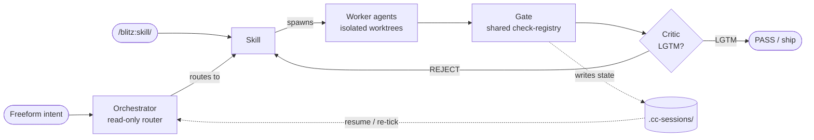
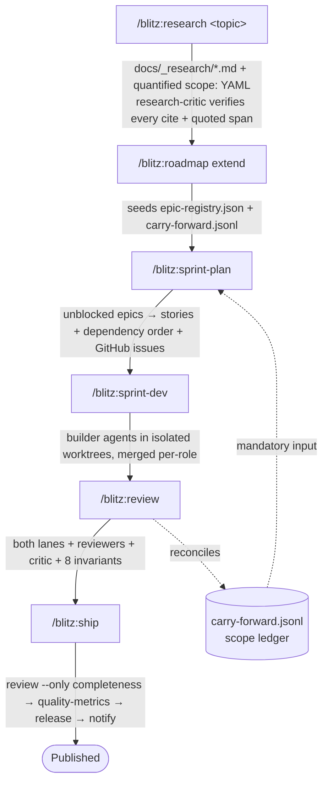
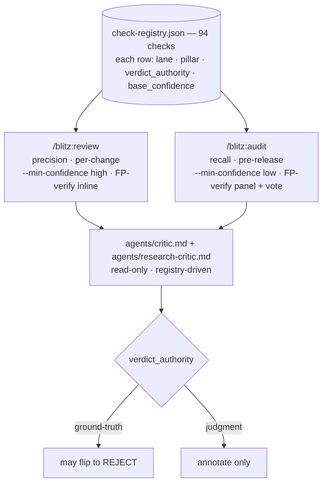
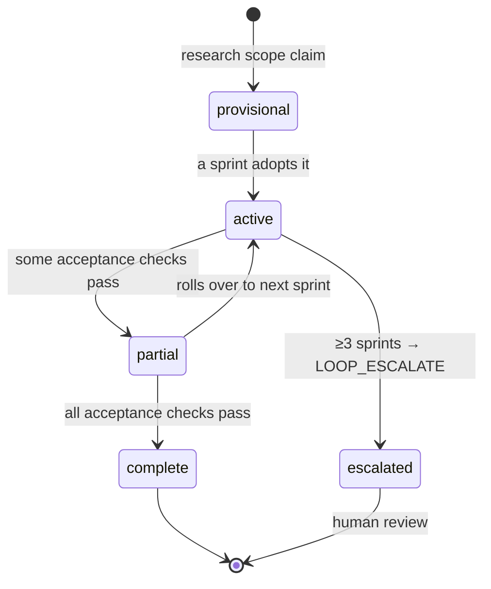

<div align="center">

```
██████╗ ██╗     ██╗████████╗███████╗
██╔══██╗██║     ██║╚══██╔══╝╚══███╔╝
██████╔╝██║     ██║   ██║     ███╔╝ 
██╔══██╗██║     ██║   ██║    ███╔╝  
██████╔╝███████╗██║   ██║   ███████╗
╚═════╝ ╚══════╝╚═╝   ╚═╝   ╚══════╝
```

**⚡ A holistic-machine Claude Code plugin for Vue/Nuxt + Firebase ⚡**

**37 skills** · **11 agents** · **38 hook scripts across 16 events** · **13 shared protocol files**

Orchestrator main-thread router · 7 anti-shortcut hooks · 8-invariant quality ratchet · optional Cross-Model Critic

[](https://opensource.org/licenses/MIT)
[](https://docs.anthropic.com/en/docs/claude-code)
[](https://github.com/lasswellt/blitz-cc/releases)

</div>

---

## What is Blitz?

Blitz is a **holistic machine**: a set of parts wired so natural-language intent goes in one end and shippable, gated code comes out the other — with no step able to silently skip the one after it. It turns Claude Code into an opinionated, partly-autonomous development environment for Vue/Nuxt + Firebase.

The mechanism in one breath: **freeform input lands on a read-only orchestrator that routes to a `/blitz:*` skill; skills spawn worker agents in isolated worktrees; every artifact they produce is checked at a gate that runs off a single shared rule registry; an adversarial critic must sign off before anything reaches `PASS`; and the whole loop persists its state to disk so it can resume itself unattended.**



Four properties make it a *machine* rather than a pile of prompts:

- **State is external and append-only.** Scope claims, sprint progress, quality metrics, and cross-session handoff all live in `.cc-sessions/` — so any tick can reconstruct what the last one was doing.
- **Gates run on data, not vibes.** Detection logic lives in one `check-registry.json`; skills and critics *select* from it. A check either fires deterministically (grep/tsc/git) or is an LLM judgment — and the registry records which, so only facts can block.
- **Verification is adversarial and external.** The critic's job is to find one reason to REJECT; the research-critic's job is to catch a hallucinated citation. Both are read-only and can be routed to a *different model family* to dodge home-model blind spots.
- **It closes the loop.** `/blitz:next --loop` reads state, dispatches exactly one phase, commits, and exits — so `/loop` or a scheduler can re-tick it toward "shippable" without a human in the chair.

---

## Reading Tiers

| Audience | Read |
|---|---|
| **Evaluating Blitz** | [What is Blitz?](#what-is-blitz) · [Quick Start](#quick-start) · [The Blitz Cycle](#the-blitz-cycle) |
| **Installing for daily use** | [Quick Start](#quick-start) · [Supported Stacks](#supported-stacks) · [Skill Catalog](#skill-catalog-37) · [Anti-shortcut blockers](#2-anti-shortcut-blockers) |
| **Contributing or forking** | [Architecture](#architecture) · [Hook Reference](#hook-reference-38-scripts-16-events) · [Shared Protocols](#shared-protocols-12) · [Sprint-review invariants](#3-sprint-review-invariants-8) |

---

## Quick Start

```bash
npx blitz-cc@latest
```

The installer detects your stack, registers the plugin, configures permissions, and wires the hooks. From then on you mostly type intent and let the orchestrator route.

<details>
<summary><b>More install options</b></summary>

**Non-interactive:** `npx blitz-cc@latest --yes`
**Bash fallback** (no Node): `curl -fsSL https://raw.githubusercontent.com/lasswellt/blitz-cc/main/installer/install.sh | bash`
**Marketplace:** `/plugin marketplace add lasswellt/blitz-cc` then `/plugin install blitz@blitz`
**Local dev:** `claude --plugin-dir ./blitz` then `/reload-plugins`

</details>

### First five minutes

```bash
/blitz:next                       # reads state, recommends the next command
/blitz:ask "I want to add X"      # routes a vague request to the right skill(s)
/blitz:research <topic>           # parallel-agent investigation → docs/_research/
/blitz:sprint                     # full cycle: plan → implement → review
/blitz:review                     # the precision quality gate, on demand
/blitz:ship                       # gates → release → publish
```

Or just type freeform — the orchestrator routes for you.

### Prerequisites

- **Claude Code** ≥ v2.1.117 for the full feature set (orchestrator main-thread activation + recent hook events). Individual `/blitz:*` slash skills run on ≥ v2.1.71; `/blitz:health` needs ≥ v2.1.152.
- **bash**, **Node.js / npx** ≥ 18.0.0, **python3**, **jq**
- **Optional external tools** (unbundled): Playwright MCP for the UI skills (`browse`, `ui-build`, `ui-audit`, `design-critic`); Gemini CLI for the opt-in Cross-Model Critic.

---

## Supported Stacks

| Layer | Supported |
|---|---|
| **Frameworks** | Vue 3 (Vite), Nuxt 3 |
| **UI** | Tailwind, Quasar, Vuetify *(auto-detected)* |
| **Backend** | Firebase / GCP, Cloud Functions v2 |
| **State** | Pinia, VueFire |
| **Testing** | Vitest, Jest |
| **Workspaces** | pnpm, Nx, Turborepo |

`scripts/detect-stack.sh` runs on every skill invocation; results cache to `.cc-sessions/stack-profile.cache` for 1 hour.

---

## The Blitz Cycle

The pipeline is a conveyor belt where **each station hands a typed artifact to the next, and the carry-forward registry threads every scope claim end-to-end so nothing is silently dropped**:



**Why it holds together:** every `scope:` claim from research becomes a carry-forward entry; sprint-plan *must* read that ledger; sprint-review reconciles it; and an entry that rolls over three sprints escalates for human review. The claim cannot evaporate between stations.

### Autonomous loop

```bash
/loop 5m /blitz:next --loop
```

`/blitz:next --loop` is the project-lifecycle reconciliation engine. Each tick reads current state, walks an 8-row decision tree, **dispatches exactly one phase**, commits/pushes, and exits cleanly so the wrapper can re-tick. Stop signals tell the wrapper when to halt:

| Signal | Meaning |
|---|---|
| `LOOP_DONE` | Idle — nothing to reconcile. |
| `LOOP_ESCALATE` | A carry-forward entry rolled over ≥3 sprints — human review required. |
| `LOOP_DEFER` | Active session conflict — keep ticking; next tick may resolve it. |
| *(no marker)* | Phase dispatched; next tick re-evaluates. |

`PreCompact` writes `.cc-sessions/HANDOFF.json` (sprint, phase, branch, head SHA, recent files); `SessionStart` detects a fresh handoff (≤24h) and resumes without re-reading every protocol. That handoff file is *how the machine survives its own context window*.

---

## The Holistic Machine

Four layers turn a skill collection into a partly-autonomous environment. Slash commands still work unchanged.

### 1. Orchestrator (freeform-input router)

`agents/orchestrator.md` is wired as the plugin's main-thread agent via `.claude-plugin/settings.json` (`{ "agent": "orchestrator" }`). It is **read-only by construction** — its tools are `Read, Grep, Glob, Bash, TaskCreate, TaskUpdate, TaskList, Monitor`, with no Write/Edit/Agent. That constraint is load-bearing: Claude Code forbids subagents from spawning subagents, so any skill that fans out parallel agents (sprint-dev, sprint-plan, research, audit, …) stays slash-invoked and the orchestrator *routes to it* rather than running it. On session start it surfaces a one-line state summary from `HANDOFF.json` + the activity feed. See [`skills/_shared/agent-orchestration.md`](skills/_shared/agent-orchestration.md).

```bash
export BLITZ_DISABLE_ORCHESTRATOR=1   # opt out per session
```

### 2. Anti-shortcut blockers

Six `PreToolUse` blockers and one `PostToolUse` typecheck ratchet stop the most damaging autonomous-coder shortcuts **at the tool boundary** — before they ever land — each returning `exit 2` with an explicit, logged override path:

`--no-verify` bypass · destructive git on a dirty tree · destructive SQL outside a migration · test deletion · `as any` insertion · test disabling · type-error regression.

These are the catastrophic (P0) plus high-risk (P1) classes from the shortcut taxonomy; they're enforced as hooks precisely because their blast radius is too large to defer to review.

### 3. Sprint-review invariants (8)

A sprint cannot reach `PASS` while any invariant fails. They are deliberately mostly *deterministic* — carry-forward consistency, the monotonic quality ratchet (`type_errors` is an absolute floor), branch hygiene, and the **critic LGTM** (Invariant 7). The judgment-heavy parts are advisory by design. Facts gate; opinions annotate.

### 4. Cross-Model Critic (optional)

The adversarial critic can be lifted verbatim and piped to a different model family (Gemini) so it doesn't share Claude's blind spots on Claude's own work:

| Env var | Mode |
|---|---|
| *(unset)* | In-Claude critic only (cheapest) |
| `BLITZ_USE_GEMINI_CRITIC=1` | Replace in-Claude critic with Gemini |
| `BLITZ_DUAL_CRITIC=1` | Run both; require both LGTM (highest signal, ~2× cost) |

**When to pay for dual** is principled: in-Claude is fine for ground-truth checks (`tsc`/`git`/reflog can't share a blind spot); dual is recommended for the semantic/judgment findings where home-model blind spots actually bite.

---

## How review & audit work (the shared-registry core)

The quality surface is **two entry points over one rule registry** — the cleanest illustration of "gates run on data, not vibes." `skills/_shared/check-registry.json` holds 94 checks split evenly across a *deterministic* and a *semantic* lane, each row tagged with its pillar, `verdict_authority`, and `base_confidence`.



Three ideas do the work:

- **Two orthogonal lanes, always both.** A *deterministic* lane (grep/AST/tsc/git/import-graph — zero false positives) and a *semantic* lane (LLM agents reasoning about behavior). They catch **disjoint** bug classes — a deleted test has no semantic signature; a wrong answer-key has no structural one — so running only one ships errors.
- **Verdict-flip asymmetry.** Each check's `verdict_authority` is *derived* from its lane + severity: ground-truth checks may flip a verdict to REJECT (and bypass confidence triage — a fact isn't ranked); judgment checks may only annotate. This neutralizes the self-critique paradox, where an over-eager opinion-critic hallucinates flaws.
- **Confidence, by skill bias.** `review` is precision-biased (suppress low-confidence advisories — it runs constantly); `audit` is recall-biased (report everything, ranked, and *aggregate* — a finding flagged by ≥2 independent agents is high-confidence; one re-read-and-refute panel drops the hallucinations). Nothing becomes a blocker without reproducing evidence.

`completeness-gate` and `integration-check` are now `review --only completeness|wiring`; the 5-pillar `audit` engine carries the aggregation + FP-verify + recall instrumentation. Detection patterns live in the registry — no skill or agent body duplicates a grep.

---

## Skill Catalog (37)

### Orchestrators

| Skill | What it does | Invocation |
|---|---|---|
| **next** | Reads sprint/roadmap/carry-forward state, recommends (or `--loop` auto-dispatches) the next action. Canonical autonomous engine. | `/blitz:next [--loop]` |
| **ask** | Classifies a vague request and routes it via decision tree. | `/blitz:ask <request>` |
| **sprint** | Full cycle: plan → implement → review. `--loop` aliases `/blitz:next --loop`. | `/blitz:sprint [--plan-only\|--skip-review\|--loop\|--gaps\|--resume]` |
| **implement** | Thin router to sprint-dev (no plan/review). | `/blitz:implement [--sprint N\|--resume]` |
| **review** | Consolidated **precision** gate — both lanes, confidence gate, FP-verify, critic; `--only` runs a folded concern. Front door that delegates the full 8-invariant gate to sprint-review. | `/blitz:review [--sprint N\|--only completeness\|wiring\|framework\|design\|full\|--dual]` |
| **audit** | Consolidated **recall** deep audit — 5 pillars + aggregation + FP-verify panel + coverage boundary. | `/blitz:audit [scope\|--pillar P\|--min-confidence low\|high\|--dual]` |
| **ship** | review → review --only completeness → quality-metrics → release → notify. Slash-only. | `/blitz:ship [version]` |

### Sprint lifecycle

| Skill | What it does | Invocation |
|---|---|---|
| **research** | Parallel research agents → `docs/_research/<date>_<topic>.md` with quantified `scope:` YAML; research-critic verifies citations + quoted spans. | `/blitz:research <topic>` |
| **roadmap** | Phased roadmaps; `extend` ingests new research into the carry-forward registry. | `/blitz:roadmap [full\|refresh\|extend\|status]` |
| **sprint-plan** | Plans a sprint from unblocked epics; reads `carry-forward.jsonl` as mandatory input; spawns GitHub issues. | `/blitz:sprint-plan [--sprint N\|--gaps]` |
| **sprint-dev** | Spawns backend/frontend/test agents in isolated worktrees; Monitor-driven; merges per-role branches on completion. | `/blitz:sprint-dev [--sprint N\|--resume\|--mode …]` |
| **sprint-review** | The `review` *engine*: 5 auto-gates + 4 reviewer agents + critic + the 8-invariant carry-forward hard gate. | `/blitz:sprint-review [--sprint N]` |

### Code quality — 2 gates, 2 tools, over the registry

| Skill | Role | Invocation |
|---|---|---|
| **review** / **audit** | the two registry-driven entry points (above) — precision gate / recall deep-audit | — |
| **code-doctor** | framework-API anti-patterns (Firestore/VueFire/Vue 3/Pinia); review embeds the scan, `--fix` stays here | `/blitz:code-doctor [--fix\|--scan]` |
| **code-sweep** | convention-discovered standards + monotonic ratchet; loop-safe continuous improvement | `/blitz:code-sweep [--loop\|--category <n>\|--deep]` |
| **ui-audit** | cross-page semantic + data-quality + UX invariants (orthogonal domain) | `/blitz:ui-audit [full\|data\|consistency\|--loop]` |
| **quality-metrics** | metric trends over time (orthogonal observability) | `/blitz:quality-metrics [collect\|dashboard\|trend\|compare]` |
| **perf-profile** | bundle / runtime / Lighthouse vs baseline (orthogonal) | `/blitz:perf-profile [bundle\|runtime\|lighthouse]` |
| **dep-health** | `npm audit` + outdated + license (orthogonal) | `/blitz:dep-health [audit\|upgrade\|report]` |

### Core development

| Skill | What it does | Invocation |
|---|---|---|
| **ui-build** | Discover → Analyze → Design → Implement → Refine; vision-critique loop via design-critic. | `/blitz:ui-build <feature>` |
| **design-extract** | Extracts brownfield design tokens → portable `DESIGN.md`. | `/blitz:design-extract` |
| **browse** | Playwright testing — console/network errors + screenshots; loop-safe. | `/blitz:browse [full\|page <path>\|fix\|--loop]` |
| **refactor** | Snapshot tests, refactor one piece at a time, revert on any regression. | `/blitz:refactor <target> <goal>` |
| **test-gen** | Tests in project conventions (Vitest/Jest), AAA + factories. | `/blitz:test-gen <file>` |
| **fix-issue** | GitHub issue → research → fix with tests → close via `gh`. | `/blitz:fix-issue <#>` |
| **migrate** | Framework/library migrations; atomic verified steps. Slash-only. | `/blitz:migrate <target>` |
| **bootstrap** | Greenfield scaffold or feature/package into an existing project. | `/blitz:bootstrap <type> <name>` |
| **quick** | Small targeted edits without sprint ceremony. | `/blitz:quick <request>` |

### Documentation & release

| Skill | What it does | Invocation |
|---|---|---|
| **doc-gen** | API/component docs, Mermaid diagrams, CHANGELOG from commits. | `/blitz:doc-gen [api\|components\|architecture\|changelog\|full]` |
| **release** | Semver, CHANGELOG, GitHub release. Slash-only. | `/blitz:release [prepare\|verify\|publish\|rollback]` |

### Analysis & meta

| Skill | What it does | Invocation |
|---|---|---|
| **codebase-map** | 4-dim brownfield onboarding map → `CODEBASE-MAP.md`. | `/blitz:codebase-map` |
| **compress** | Terse-rewrites markdown (preserves code/URLs/tables); `.original` backup. | `/blitz:compress <file>` |
| **retrospective** | Mines activity-feed + diffs → safety-classified self-improvement proposals. | `/blitz:retrospective` |
| **setup** | Detects CLAUDE.md ↔ skill conflicts; validates permissions/stack. | `/blitz:setup` |
| **health** | Plugin structural integrity (hooks, sessions, locks, frontmatter). | `/blitz:health` |
| **conform** | Migrates a project's blitz runtime artifacts to current schemas. | `/blitz:conform [dir] [--fix\|--scope plugin]` |
| **todo** | Tracks todos in `.cc-sessions/todos.jsonl` with `file:line`. | `/blitz:todo [add\|list\|resolve]` |
| **worktree-prune** | Safely deletes stale agent-spawned branches (dry-run default). | `/blitz:worktree-prune [--apply --merged-only]` |

### At a glance

- **Loop-safe** (4): `browse`, `code-sweep`, `next`, `ui-audit` — one unit of work per tick (`sprint --loop` aliases `next --loop`).
- **Slash-only** (`disable-model-invocation`, 3): `migrate`, `release`, `ship` — destructive/irreversible, never auto-fire.
- **Read-only by default**: `conform`, `design-extract`, `dep-health`, `health`, `perf-profile`, `setup`, `ui-audit`, `worktree-prune` — mutate only with an explicit `--fix`/`--apply` flag.
- **Multi-agent super-orchestrators** (slash-invoked, spawn parallel waves): `sprint-dev`, `sprint-plan`, `sprint-review`, `research`, `audit`, `quality-metrics`, `code-sweep`, `code-doctor`, `ui-audit`.

---

## Agent Catalog (10)

Three roles. **Builder agents** are spawned by skills via `Agent({isolation: "worktree"})` — each gets its own auto-cleaned branch. **Critic agents** are read-only adversarial reviewers at gate points. The **orchestrator** is the main-thread router.

### Builder agents (6)

| Agent | Model | Role |
|---|---|---|
| **backend-dev** | sonnet | Cloud Functions v2 / Zod / Firestore; numbered flow (Auth → Validate → Logic → Audit → Return). |
| **frontend-dev** | sonnet | Vue 3 `<script setup>` / Pinia; adapts to Tailwind / Quasar / Vuetify. |
| **test-writer** | sonnet | Vitest/Jest, AAA + factories. Spawned by `test-gen` / sprint-dev. |
| **reviewer** | sonnet | OWASP top-10 + pattern violations; writes findings incrementally. Spawned by `review` / sprint-review. |
| **architect** | sonnet | Read-only structural analysis — coupling, cohesion, circular deps. Orchestrator-delegated. |
| **doc-writer** | haiku | API docs, ADRs, README sections (mechanical → cheaper model). Spawned via `doc-gen` / orchestrator. |

### Critic agents (3) — adversarial reviewers

| Agent | Model | Role | Verdict |
|---|---|---|---|
| **critic** | sonnet | Registry-driven pre-`PASS` reviewer: 20-detector taxonomy + ratchet + acceptance-checks + reflog/rename scans. **Verdict-flip asymmetry** — ground-truth → REJECT, judgment → annotate. Halts at first reject. | `LGTM \| REJECT` |
| **research-critic** | sonnet | Probes every cited URL (LIVE/DEAD/LIKELY_HALLUCINATED/UNKNOWN), verifies quoted spans (Deterministic Quoting) + grounds quantified claims; a `scope:` claim with no resolvable cite is a blocker. | `PASS \| UNVERIFIED \| CITATIONS_MISSING` |
| **design-critic** | sonnet | Vision-based aesthetic scorer against `DESIGN.md`; 5 dimensions; Playwright nav-subset only (no `browser_evaluate`). | `PASS \| ITERATE \| REWORK` |

### Orchestrator (1)

| Agent | Model | Role |
|---|---|---|
| **orchestrator** | sonnet | Read-only main-thread router (no Write/Edit/Agent — cannot spawn subagents). Surfaces in-flight state from `HANDOFF.json` + activity feed, routes to a `/blitz:*` skill. `BLITZ_DISABLE_ORCHESTRATOR=1` to opt out. |

Model defaults follow a 60/35/5 Haiku/Sonnet/Opus routing recorded in `.claude-plugin/model-profiles.json`; a spawning skill may bump a worker to opus for genuinely heavy reasoning.

---

## Carry-Forward Registry

`.cc-sessions/carry-forward.jsonl` is the backbone of the cycle — an append-only ledger that tracks quantified scope claims across sprints so none is silently dropped. It's *why* the conveyor belt holds.

### Lifecycle



A claim enters `provisional` from research, becomes `active` when a sprint adopts it, `partial` when some acceptance checks pass, and `complete` only when all do. Every reader follows one canonical Reader Algorithm; writers append, never rewrite.

### Quality ratchet

Eight monotonic metrics (type errors, test count, mocks-in-src, `as any` count, stale worktree branches, …) are persisted and **may only improve**. A regression without a covering carry-forward entry auto-reverts. `type_errors > 0` is an absolute floor — it can never ratchet up.

---

## Worktree Lifecycle

Builder agents run in isolated git worktrees on per-role branches (`sprint-N/{backend,frontend,tests,…}`). A spawn-time collision guard prevents reusing a dirty branch; sprint-dev Phase 4.4 merges and deletes them; `/blitz:worktree-prune` sweeps any stragglers (dry-run by default, `--merged-only` is always safe). Stale-branch count is itself a ratchet metric.

---

## Parallel Sessions (native agent view)

Every blitz skill (`/blitz:*`) and agent is a valid dispatch target for Claude Code's native agent view (`claude agents`, CC ≥2.1.139) — run `claude --bg "/blitz:audit"` or type the command into the agent-view input to run blitz work as a background session. blitz does **not** reimplement the agents view, recaps, or terminal multiplexing; it interops:

- **Worktree reconciliation** — background sessions auto-isolate into `.claude/worktrees/`; `/blitz:worktree-prune` never removes a worktree a live `claude agents` session owns (data-loss guard via `claude agents --json`).
- **Conflict overlay** — blitz's semantic conflict matrix extends to background sessions (the platform manages processes, not semantic conflicts).
- **Remote alerts** — `PushNotification` fires off-screen on stuck-loop / Tier-3 escalation (gated on developer-profile `notify`); `BLITZ_NOTIFY_ON_IDLE=1` adds an idle terminal bell.

Full contract: [`skills/_shared/agent-orchestration.md`](skills/_shared/agent-orchestration.md).

---

## Token Budget

Model routing follows a 60/35/5 Haiku/Sonnet/Opus matrix: cheap mechanical work (docs) on Haiku, the bulk of builder/reviewer work on Sonnet, orchestration reasoning on Opus. Prompt caching (1-hr TTL) and lazy MCP/skill loading keep cost down; agents reply with a structured JSON contract rather than echoing findings. See [`skills/_shared/agent-orchestration.md`](skills/_shared/agent-orchestration.md).

---

## Architecture

```
blitz-cc/
├── .claude-plugin/
│   ├── plugin.json              # manifest (main-thread agent = orchestrator)
│   ├── marketplace.json         # single-plugin marketplace (source: ./)
│   ├── settings.json            # { "agent": "orchestrator" }
│   ├── counts.json              # CI-enforced authoritative component counts
│   └── model-profiles.json      # per-agent model defaults (60/35/5 routing)
├── agents/                      # 11 agents (7 builder · 3 critic · 1 orchestrator)
├── skills/
│   ├── <name>/SKILL.md          # 37 skills (Anthropic-canonical, auto-discovered)
│   └── _shared/                 # 13 shared protocol files + check-registry.json
├── hooks/
│   ├── hooks.json               # 16 events
│   └── scripts/                 # 38 scripts: 35 event-wired + 2 sub-invoked + 1 critic-spawned
├── output-styles/
│   └── terse-technical.md       # the plugin output style
├── scripts/                     # detect-stack, count-sync, version-sync, structure validators
└── installer/                   # npx blitz-cc CLI
```

Skills are auto-discovered from `skills/<name>/SKILL.md` — no central registry. Every SKILL.md satisfies a frontmatter contract (third-person description ≤1024 chars, body ≤500 lines, required fields, the verbatim OUTPUT STYLE snippet) enforced by `skill-frontmatter-validate.sh`.

### Runtime artifacts

Everything mutable lives under `.cc-sessions/` (gitignored): `activity-feed.jsonl` (cross-session event log), `carry-forward.jsonl` (scope ledger), `HANDOFF.json` (compaction/resume), `ratchet.json` (quality floors), session registration + locks, `developer-profile.json` (autonomy). This is the machine's memory.

### Conforming after upgrades

`/blitz:conform` detects schema drift in a project's `.cc-sessions/` + sprint artifacts after a blitz upgrade and migrates them idempotently (`--fix`). `--scope plugin` targets SKILL.md + hooks instead. Read-only by default.

---

## Hook Reference (38 scripts, 16 events)

Hooks are *the* enforcement layer — they fire on tool calls the model can't talk its way around. Of the 38 scripts, 35 are event-wired; the rest are sub-invoked (`check-registry-validate.sh`, `startup-validate.sh`) or critic-spawned (`critic-gemini.sh`). Across 16 events (`SessionStart`, `UserPromptExpansion`, `PreToolUse`, `PostToolUse`, `PreCompact`, `PostCompact`, `TaskCompleted`, `TeammateIdle`, `SubagentStart`, `SubagentStop`, `PostToolBatch`, `PostToolUseFailure`, `StopFailure`, `PermissionRequest`, `WorktreeCreate`, `WorktreeRemove`) they handle file protection, auto-format/lint/test, commit validation (frontmatter lint, version sync, link rot, **registry schema lint**), context monitoring, activity-feed logging, and the **7 anti-shortcut blockers** (5 P0 + 2 P1). Full index grouped by event: [`hooks/scripts/README.md`](hooks/scripts/README.md).

> Hook commands reference scripts via `"${CLAUDE_PLUGIN_ROOT}"` (quoted, shell-form) so install paths with spaces resolve correctly. No blitz hook executes project-controlled content pre-trust — see [`skills/_shared/security.md`](skills/_shared/security.md).

### Environment overrides

`BLITZ_DISABLE_ORCHESTRATOR`, `BLITZ_DISPATCH` (auto\|workflow\|agent), `BLITZ_USE_GEMINI_CRITIC`, `BLITZ_DUAL_CRITIC`, `BLITZ_OVERRIDE_NO_VERIFY`, `BLITZ_AUDIT_CONFIDENCE_THRESHOLD`, `BLITZ_NOTIFY_ON_IDLE` — each documented at its point of use.

---

## Shared Protocols (12)

All skills share 12 protocol files (+ `check-registry.json`) in [`skills/_shared/`](skills/_shared/) that define cross-cutting behavior — so the machine's parts agree on contracts instead of each re-inventing them. As of the 2026-06-06 consolidation each file owns one concern (former fragments absorbed; see each file's top-of-file map):

- **terse-output.md** — output style + canonical exemptions + console verbosity / activity-feed logging
- **session-lifecycle.md** — multi-session safety (locks, autonomy), checkpoints, context/compaction handoff, state-handoff resume contract, `/loop` vs `/schedule` mechanics
- **sprint-contracts.md** — scope-ledger (carry-forward) Reader Algorithm + writer contract, story frontmatter, Definition of Done, deviation + scope-limit
- **agent-orchestration.md** — agent fan-out (spawn/weight/HEARTBEAT, routing, token-budget) + the opt-in `Workflow` dispatch path
- **quality-engine.md** (+ **check-registry.json**) — single source of truth for every review/audit check, the 20-detector catalog (13 reject, 7 advisory), the 8-metric ratchet, the deterministic verification recipe
- **security.md** — containment posture / threat model (TB-1…TB-4), hook-trust boundary, package-install policy
- Plus: **project-context.md**, **skill-cross-references.md**, **design-criteria.md**, **knowledge-protocol.md**, **session-report-template.md**, **worktree-lifecycle.md**

---

## Model Profiles

`.claude-plugin/model-profiles.json` records the per-agent model defaults (the 60/35/5 routing). Builder/reviewer agents pin `sonnet`, `doc-writer` pins `haiku`, and skills inherit the session model unless they override — set explicitly so a `[1m]`-context parent never accidentally drags a worker onto the wrong tier.

---

## Installer CLI

`npx blitz-cc@latest` (source in `installer/`) detects the stack, registers the plugin + marketplace, writes permissions, and wires the hooks. `--yes` for non-interactive; a pure-bash `install.sh` fallback exists for Node-less environments. `uninstall.js` reverses it.

---

## Contributing

Blitz develops *itself* through its own cycle — this README's structure, the review/audit consolidation, and the counts you're reading were produced by sprints that ran `/blitz:sprint-review` and the adversarial critic on their own output. Fork-friendly: `/blitz:conform --scope plugin` audits structural drift, and the frontmatter + link + count-sync + structure validators run on every commit (`scripts/check-count-sync.sh`, `scripts/check-version-sync.sh`, `scripts/validate-plugin-structure.sh`).

---

## Acknowledgments

The clarification-gate principles are adapted from [multica-ai/andrej-karpathy-skills](https://github.com/multica-ai/andrej-karpathy-skills) (MIT). Effectiveness research (two-lane detection, multi-review aggregation, the self-critique paradox, citation-grounding) is cited in `docs/consolidation/review-audit/effectiveness-research.md`.

---

## License

MIT — see [LICENSE](LICENSE).
