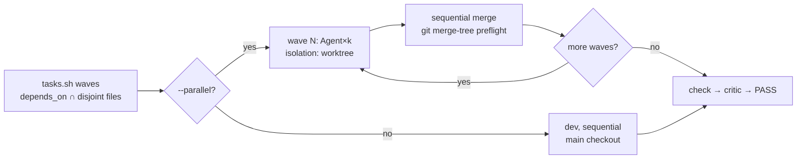

# blitz-cc agentic architecture audit

**Verdict.** The plugin is already at the structural target the commissioning brief asks it to migrate toward: 21 discrete skills with progressive disclosure, 5 agents with explicit model routing, a `.claude-plugin/` manifest, 32 hook scripts across 14 events. Four of the brief's five directives describe work that shipped in 3.0.0 on 2026-09-19. What the brief does not describe is the defect that matters most: **blitz-cc's `WorktreeCreate` hook registration disables git worktree creation in every project that installs the plugin.** That is a P0 and it takes down the exact feature the brief wants elevated.

This document separates the brief's premises from the repository's and the platform's actual state, then gives the real findings and a sequenced migration.

---

## 1. Premise reconciliation

| # | Brief asserts | Verified state | Disposition |
|---|---|---|---|
| P1 | "monolithic `SKILL.md` routing file" needs deconstruction into `skills/` | 21 skill directories, each with its own `SKILL.md` + `references/`; no router file exists. The monolith was removed in 3.0.0 (38 skills → 21, 10,851 → 6,223 lines) | **Withdrawn.** No work. |
| P2 | Transition to "standardized `.claude-plugin/` manifest architecture" | `.claude-plugin/plugin.json` + `marketplace.json` + `compat.json` present and loading | **Withdrawn**, with two real gaps (§2). |
| P3 | "sprint-driven DAG epic execution" is the target | The sprint/story/epic layer was deliberately deleted in 3.0.0 as ceremony: "a Scrum simulator whose 'done' was a prose promise". The DAG survived as `tasks.json` `depends_on[]` | **Reframed.** The DAG is real and keeps improving; reintroducing sprints reverses a decision made on evidence. |
| P4 | `isolation: "worktree"` should be adopted in `agents/` | Valid frontmatter field, confirmed. blitz uses the `Agent({isolation:"worktree"})` call-site form instead, correctly: `build --parallel` is opt-in and the same `dev` agent must also run sequentially | **Partially adopted.** Keep call-site form for `dev`; the P0 must be fixed before either form works at all. |
| P5 | Route validation to "Claude 3.5 Haiku", orchestration to "Claude 3.5 Sonnet or Opus" | The 3.5 generation is two generations stale. Current: Opus 5, Sonnet 5, Haiku 4.5, Fable 5.1. blitz already routes `Explore`/retrieval → `haiku`, `dev`/`test-writer` → `sonnet`, `critic` → `opus` | **Withdrawn as stated**, retained as a gap analysis (§4.3). |
| P6 | Reduce "static system prompts to under 800 tokens"; "anchor prefixes against auto-compaction boundaries" | A plugin cannot write the system prompt. Per platform caching docs, plugin skills/commands/agents/hooks/monitors/themes **never invalidate the cached prefix**: they append as conversation messages. Compaction invalidates the conversation layer by design; nothing anchors against it | **Reframed.** The real cost is protocol load per invocation, measured at 41K–47K tokens (§4.1). |

The brief's framing of token economics is the one worth correcting in detail, because acting on it as written would spend effort on a layer the plugin does not own. §4 gives the levers a plugin actually holds.

---

## 2. Findings

| ID | Sev | Surface | Finding |
|---|---|---|---|
| **F-01** | **P0** | `hooks/hooks.json` | Registering `WorktreeCreate` replaces git worktree creation entirely. blitz's handler creates nothing and prints no path. Platform contract: "If the hook fails or produces no path, worktree creation fails with an error." Every `claude --worktree`, every `isolation: worktree` subagent, and every background-session worktree fails in any project with blitz installed. |
| **F-02** | **P0** | `hooks/scripts/worktree-create.sh` | Reads `worktree_path` and `branch` from stdin. Neither field exists on `WorktreeCreate`; the only extra field is `name`. The stale-branch collision guard is unreachable dead code and has never fired. |
| **F-03** | **P1** | `hooks/hooks.json` | A registered `WorktreeCreate` hook makes the platform **skip `.worktreeinclude`**. Consumers lose `.env` propagation into worktrees with no diagnostic. |
| **F-04** | **P1** | `hooks/tests/` | 24 bats files, zero covering `worktree-create.sh` or `worktree-remove.sh`. F-01/F-02 shipped through a repo that otherwise gates on tests. |
| **F-05** | **P1** | `skills/_shared/agents.md` §6 | Documents the inverted contract: "`WorktreeCreate` hooks can abort creation (non-zero exit) or override the path (stdout)" and "`WorktreeRemove` exit codes are ignored." Both are wrong; the second is wrong in the unsafe direction. |
| **F-06** | **P1** | `skills/_shared/*.md` | One `/blitz:build` that follows its own cross-references loads ~41.5K tokens of protocol; `/blitz:check` ~47.3K. 20–25% of a 200K window consumed before any project code is read. |
| **F-07** | **P1** | `hooks/scripts/post-edit-typecheck-block.sh` | `[[ -f tsconfig.json ]] \|\| exit 0`. The type-error ratchet, the plugin's headline anti-regression mechanism, is a silent no-op in every non-TypeScript repository. |
| **F-08** | **P1** | `hooks/scripts/post-edit-format.sh` | Extension allowlist `ts\|tsx\|js\|jsx\|vue\|css\|scss\|json\|md\|html\|ya?ml`. Python, Rust, Go, Java, Ruby, C# edits are never formatted or linted, silently. |
| **F-09** | **P2** | `.claude-plugin/plugin.json` | `description` is a 1,421-character prose block opening "Agentic development loop for Vue/Nuxt + Firebase". It is the plugin's storefront copy in `/plugin` and the marketplace, and it declares the plugin language-specific in its first six words. `keywords` leads with `vue`, `nuxt`, `firebase`. |
| **F-10** | **P2** | `.claude-plugin/plugin.json` | No `lspServers` key. LSP is a first-class plugin component and the correct answer to the brief's semantic-navigation directive. |
| **F-11** | **P2** | `scripts/detect-stack.sh` | Detection is `package.json`-only: no `pyproject.toml`, `Cargo.toml`, `go.mod`, `pom.xml`, `Gemfile`, `*.csproj`. |
| **F-12** | **P2** | `agents/critic.md`, `design-critic.md`, `research-critic.md` | No `experimental.cacheTtl`. `dev` and `test-writer` set `1h`; the three critics inherit the 5-minute subagent default and pay a full uncached prefix on every re-spawn in a fix loop. |
| **F-13** | **P2** | `skills/ship/SKILL.md`, `skills/migrate/SKILL.md` | Both pin `model: opus` in frontmatter. A skill whose frontmatter names a model different from the session's makes that turn a full model switch with zero cache hits across the entire conversation. `ship` documents the tradeoff; `migrate` does not. |
| **F-14** | **P2** | `hooks/hooks.json` | Every `Bash`/`PowerShell` call spawns 8 hook processes serially (1 unmatched + 1 tasks-guard + 6 matched). Every `Write`/`Edit` spawns 6 before the edit and 5 after. Per-tool-call latency is unmeasured. |
| **F-15** | **P2** | `skills/_shared/check-registry.json` | 98KB / 97 rows loaded as one file. Rows are stack-tagged in name only (`fw-firestore-vue-pinia`) with no `stacks[]` field to filter on. |

---

## 3. Domain 1 — Manifest and structural compliance

### 3.1 Current layout is compliant

```
blitz-cc/
├── .claude-plugin/
│   ├── plugin.json          ← metadata only; components auto-discovered
│   ├── marketplace.json
│   └── compat.json          ← repo convention, not a platform file
├── skills/                  ← 21 skills, auto-discovered
│   ├── _shared/             ← 6 protocols + check-registry.json
│   └── <name>/
│       ├── SKILL.md         ← YAML frontmatter: name, description, …
│       ├── references/      ← progressive disclosure tier 2
│       └── assets/
├── agents/                  ← 5 agents, auto-discovered
├── hooks/
│   ├── hooks.json           ← auto-discovered
│   └── scripts/
├── workflows/               ← 3 Workflow scripts
├── output-styles/
└── scripts/                 ← repo tooling, not a plugin component dir
```

The manifest is optional and blitz's is metadata-only, so every component directory resolves by auto-discovery. Naming is already kebab-case throughout. **No restructuring is required.** Adding explicit `skills`/`agents`/`commands` keys would be a regression: per the plugin reference, a manifest key *replaces* the default directory scan, so a typo silently unloads a whole component class.

### 3.2 The two changes worth making

```jsonc
{
  "name": "blitz",
  "version": "3.1.0",

  // F-09: lead with the loop, not the stack. Keep it short; the long-form
  // pitch belongs in README.md, which the marketplace links.
  "description": "Language-agnostic agentic development loop: research, plan, build, check, ship. Plans are JSON task DAGs with per-task verify commands; a task is done only when scripts/tasks.sh verified it and a hook denies every other write. Fresh-context dev agent per task, opt-in parallel worktree waves, adversarial critic before PASS, anti-shortcut hooks, kill switch, unattended ticks via next --loop. Requires Claude Code >=2.1.271.",

  "keywords": [
    "agentic-loop", "verification", "tasks", "dag",
    "development-workflow", "code-review", "testing",
    "polyglot", "typescript", "python", "rust", "go"
  ],

  // F-10: ship LSP config so semantic navigation replaces grep.
  "lspServers": "./.lsp.json",

  "author": { "name": "lasswellt" },
  "homepage": "https://github.com/lasswellt/blitz-cc",
  "repository": "https://github.com/lasswellt/blitz-cc",
  "license": "MIT"
}
```

Keep `description` under ~400 characters. It is displayed copy, and the long version currently duplicates README content that the marketplace already surfaces.

---

## 4. Domain 2 — Concurrency and worktree isolation

### 4.1 F-01/F-02: the P0

Current registration:

```json
"WorktreeCreate": [
  { "hooks": [ { "type": "command",
      "command": "\"${CLAUDE_PLUGIN_ROOT}\"/hooks/scripts/worktree-create.sh" } ] }
]
```

Current handler, abridged:

```bash
WORKTREE_PATH=$(blitz_extract worktree_path)   # field does not exist
BRANCH=$(blitz_extract branch)                 # field does not exist
if [[ "$BRANCH" =~ ^worktree-agent-[0-9a-f]{8}$ ]]; then …; fi   # never true
blitz_log_event "hook" "worktree_create" …
# IMPORTANT: do NOT print to stdout; that would override the default worktree path.
exit 0
```

The comment states the inverted contract. Platform documentation, verbatim:

> Configuring a WorktreeCreate hook replaces that default git behavior […]
> Because the hook replaces the default behavior entirely, `.worktreeinclude` is not processed.
> The hook must return the path to the created worktree directory.
> If the hook fails or produces no path, worktree creation fails with an error.

And the actual input schema:

```json
{ "session_id": "abc123", "transcript_path": "…", "cwd": "…",
  "hook_event_name": "WorktreeCreate", "name": "feature-auth" }
```

`name` is the only event-specific field. There is no `worktree_path`, no `branch`, no `base_ref`.

**Blast radius.** Any project with blitz installed loses: `claude --worktree`, every subagent with `isolation: worktree` (including blitz's own `build --parallel` waves, which `doctor` D-304 asserts a setting for), background-session isolation, and desktop parallel sessions. The observable symptom is a worktree-creation error naming the path, which reads as a git or platform fault rather than a plugin fault.

**Fix: deregister.** `WorktreeCreate` has no observe-only mode. There is no way to log a creation without owning it, and owning it means reimplementing `git worktree add`, `.worktreeinclude` copying, filter-driver neutralization, symlink screening, and the creation marker the cleanup sweep reads. That is platform surface blitz should not carry. Remove the registration and delete the handler.

The collision guard the handler intended keeps its value; it moves to where it can run:

| Guard | New home | Mechanism |
|---|---|---|
| Stale `worktree-agent-<8hex>` branch ahead of `origin/HEAD` | `skills/doctor` as row **D-305**, and `build` Phase 0.4 parallel preconditions | Pre-flight `git for-each-ref` scan before any wave dispatches, not a per-creation veto |
| Worktree inventory and safe pruning | `skills/sessions` mode `worktrees` | Already implemented; unchanged |

`SubagentStart` is not an alternative home: it fires on spawn but the docs are explicit that it "can't block subagent creation."

`WorktreeRemove` **stays registered.** It is additive for git worktrees (the platform still runs `git worktree remove`), the handler already always exits 0, and its `worktree_path` field is real. Two corrections apply: the doc claim that its exit code is ignored must be fixed (a non-zero exit fails the removal when the directory survives), and the opportunistic branch cleanup should resolve the branch before the directory disappears rather than via `git worktree list` after.

### 4.2 `.worktreeinclude` (F-03)

With the `WorktreeCreate` registration removed, `.worktreeinclude` works natively and the brief's requirement is satisfied by the platform. `doctor` should write a starter file rather than blitz reimplementing the copy:

```text
# .worktreeinclude — gitignored files copied into every worktree Claude creates.
# .gitignore syntax. Only files that match AND are gitignored are copied.
.env
.env.local
.env.test
# A '**/' pattern only reaches into a wholly-ignored directory when the first
# name after '**/' is a segment of that directory's path. Name the directory
# instead when it does not:
config/secrets.json
```

New `doctor` row:

| ID | Assertion | Verdict | Fix |
|---|---|---|---|
| D-306 | Project has gitignored env files AND `.worktreeinclude` absent | **WARN** | Write the starter above (`fix:auto`), listing the gitignored `.env*` files actually present |

The isolated-state bootstrap the brief asks for (dependency install, ephemeral database) belongs in `SessionStart`, not `WorktreeCreate`. `SessionStart` fires inside the new worktree with `cwd` set to it, carries a `source` field, and cannot break worktree creation if it fails. `session-start.sh` already reads `cwd`; gating a project-defined bootstrap command on "cwd is under `.claude/worktrees/` and `node_modules`/`.venv`/`target` is absent" is a ~15-line addition with no platform-contract risk.

### 4.3 DAG execution

`tasks.json` already carries `depends_on[]` and `files[]`, and `build` computes waves as "tasks whose `depends_on` are all `done`". The DAG is real. Three refinements:

1. **Wave admission is dependency-only; it should also be file-disjointness.** Two ready tasks touching the same path must not enter the same wave. Compute the wave as a maximal antichain under `depends_on` **intersected with** pairwise-disjoint `files[]`, then cap at 4.
2. **Make the wave plan an artifact.** `scripts/tasks.sh waves` emitting `[[T-003,T-007],[T-004]]` lets `doctor` and evals assert the schedule without re-deriving it from prose.
3. **Keep `dev` free of `isolation: worktree` frontmatter.** The same agent runs sequentially (default) and in waves (`--parallel`). Pinning isolation in frontmatter would force a worktree on every sequential build, and sequential is the documented default for good reason (cross-agent conflict rate 41.7% vs 19.8% intra-agent). The call-site `Agent({isolation: "worktree"})` form is correct here.



---

## 5. Domain 3 — Token economics

### 5.1 What a plugin can and cannot control

| Layer | Owner | Plugin influence |
|---|---|---|
| System prompt (core instructions, tool definitions) | Claude Code | **None.** Not reachable from a plugin. |
| Project context (CLAUDE.md, memory) | User/repo | Indirect, via what `doctor` writes |
| Conversation (skills, agents, hooks, tool results) | Plugin | **Total.** And per the caching docs, plugin components "never invalidate the cache": they append. |

Consequence: the brief's "reduce static system prompts to under 800 tokens" and "anchor prefixes against auto-compaction boundaries" have no plugin-side implementation. Enabling blitz already costs zero cache invalidation because it ships no MCP server. The cost is not cache misses. The cost is **absolute tokens per invocation**, and that is large.

### 5.2 F-06: measured protocol load

| Invocation | Files the skill instructs the model to read | Bytes | ≈ Tokens |
|---|---|---|---|
| `/blitz:build` | `SKILL.md` + `loop.md` + `agents.md` + `quality.md` + `sessions.md` + `security.md` + `output.md` | 166,284 | **41,571** |
| `/blitz:check` | `SKILL.md` + `references/main.md` + `check-registry.json` + `quality.md` + `loop.md` | 189,184 | **47,296** |

`build/SKILL.md` lines 15–19 name five shared protocols in its first screen, so a compliant model reads all five.

**Refactor: split each protocol into a contract head and reference tail.**

```
skills/_shared/
├── loop.md              ≤ 2,500 B   task schema, gate arming, marker vocabulary
├── loop.reference.md              rationale, worked examples, migration notes
├── agents.md            ≤ 2,500 B   roster table, spawn-spec index, reply enum
├── agents.reference.md            §5.2 preconditions, §6 platform facts, §7 Workflow
├── quality.md           ≤ 2,500 B   structural-done rule, DoD list, registry pointer
├── quality.reference.md
├── sessions.md          ≤ 2,000 B   claim protocol, conflict matrix
├── sessions.reference.md
├── security.md          ≤ 2,000 B   TB-1…TB-4 one-liners, kill switch
├── security.reference.md
└── output.md            ≤ 1,500 B
```

Skill bodies link the head; the head links the tail for the one case that needs it. Target: **≤ 13KB / ~3,300 tokens** for the six heads combined, down from 141KB / ~35K. Enforce with a `pre-commit-validate.sh` byte-cap assertion so the heads cannot regrow.

**`check-registry.json` (F-15):** add `stacks: ["*"]` or `["node","python",…]` per row, and have `check` select with `jq` rather than reading the file into context. 97 rows at 98KB is a database, and it should be queried:

```bash
jq -r --arg s "$STACK" '.checks[] | select(.lane=="deterministic")
  | select((.stacks // ["*"]) | index("*") or index($s))
  | "\(.id)\t\(.detection.command)"' "${CLAUDE_PLUGIN_ROOT}/skills/_shared/check-registry.json"
```

### 5.3 The cache levers that are real

| Lever | Status | Action |
|---|---|---|
| `experimental.cacheTtl: 1h` on subagents | `dev` ✅, `test-writer` ✅, three critics ❌ | **F-12:** add to all three. The critic re-spawns up to 5 times in a fix loop; the 5-minute default guarantees a cold prefix on rounds 2+. |
| Skill frontmatter `model:` | `ship` and `migrate` pin `opus` | **F-13:** `ship` is slash-only and rare, so accept and keep the documented rationale. `migrate` runs once per consumer upgrade; accept, but add the same one-line disclosure `ship` carries. Add a `skill-frontmatter-validate.sh` rule: any `model:` in a skill requires an adjacent cost-disclosure line. |
| Dynamic `Agent({model})` | Used correctly throughout | No change. Each subagent is its own cache; a per-call model is free to the parent. |
| `SubagentStart.additionalContext` | Unused | **New.** This is the genuine static/dynamic segregation the brief asks for, at the layer where it exists. |

**`SubagentStart` segregation.** The invariant half of the 11-item dev spawn spec (never-edit list, mock policy, output contract, reply enum) is identical across every `dev` spawn; only the task half varies. Moving the invariant half into a hook makes it byte-identical per spawn, and the platform states the injected copy "stays in place, leaving the subagent's prompt cache intact," with re-injection only after the subagent's own auto-compaction discards it.

```json
"SubagentStart": [
  { "matcher": "^blitz:(dev|test-writer)$",
    "hooks": [ { "type": "command",
      "command": "${CLAUDE_PLUGIN_ROOT}/hooks/scripts/subagent-context.sh",
      "args": [], "timeout": 10 } ] }
]
```

```bash
#!/usr/bin/env bash
# subagent-context.sh — inject the invariant half of the dev spawn spec.
# Static by construction: no timestamps, no command output, no session id.
set -euo pipefail
. "$(dirname "$0")/_lib/common.sh"
INPUT=$(cat 2>/dev/null || echo "{}")
AGENT_TYPE=$(blitz_extract agent_type)
CTX=$(cat "$(dirname "$0")/../../skills/_shared/spawn-invariant.md")
jq -n --arg c "$CTX" \
  '{hookSpecificOutput:{hookEventName:"SubagentStart", additionalContext:$c}}'
```

The rule this encodes, and the one the brief was reaching for: **anything that varies per call goes in the prompt; anything that does not goes in `additionalContext`.** Never interpolate a timestamp, a session id, or command output into the injected block.

### 5.4 Model routing (F-05 reframed)

blitz's routing is already correct in shape. Current state and the one gap:

| Work class | Current | Assessment |
|---|---|---|
| Retrieval, triage, one-line summaries, `Explore` | `haiku` | Correct |
| Research fan-out (`library-docs`, `web-researcher`, `infra-analyst`) | `haiku` | Correct |
| Codebase analysis in research | `sonnet` | Correct |
| Implementation (`dev`), test authoring (`test-writer`) | `sonnet` | Correct |
| Fix-loop rounds 4–5 | `opus` via `Agent({model})` | Correct: escalate only after cheap rounds fail |
| Adversarial verdict (`critic`) | `opus` | Correct |
| **Deterministic-lane check execution** | main session | **Gap.** `det-01`…`det-20` are exit-code assertions with no judgment. Route the collection pass through one `haiku` subagent returning `{id, exit_code, stderr_head}`; keep the semantic lane and the verdict on the session model. |

Use the aliases (`haiku`, `sonnet`, `opus`), not pinned IDs. The repo's existing rule in `agents.md` §1.3 that every agent sets `model:` explicitly and never inherits is correct and should stay; inheritance propagates the parent's `[1m]` context flag and a sonnet agent spawned from an opus `[1m]` parent fails at load.

---

## 6. Domain 4 — Language agnosticism and semantic intelligence

### 6.1 The coupling is in three files

| File | Coupling | Effect |
|---|---|---|
| `post-edit-typecheck-block.sh` | `[[ -f tsconfig.json ]] \|\| exit 0`; `tsc`/`vue-tsc` via `npx` | **F-07.** The ratchet is dead outside TypeScript. |
| `post-edit-format.sh` | Extension allowlist; prettier/biome/eslint only | **F-08.** No formatting or linting outside the JS/TS family. |
| `detect-stack.sh` | `package.json` grep only | **F-11.** Every non-Node repo reports an empty stack. |

Plus `check-registry.json` row `fw-firestore-vue-pinia` and the `plugin.json` description (F-09).

### 6.2 Toolchain manifest: one indirection, no per-language scripts

Replace hardcoded tool invocation with a declarative table resolved once per repository. `detect-stack.sh` writes `.cc-sessions/toolchain.json`; the two `post-edit-*` hooks read it and execute whatever it names.

```json
{
  "$schema": "blitz-toolchain/1.0",
  "detected_at": "2026-09-19T00:00:00Z",
  "stacks": ["node", "python"],
  "lanes": {
    "format":    [ { "match": "\\.(ts|tsx|js|jsx|vue|css|scss|json|md|ya?ml)$",
                     "cmd": ["npx","--no-install","prettier","--write","{file}"] },
                   { "match": "\\.py$",  "cmd": ["ruff","format","{file}"] },
                   { "match": "\\.rs$",  "cmd": ["rustfmt","{file}"] },
                   { "match": "\\.go$",  "cmd": ["gofmt","-w","{file}"] } ],
    "lint":      [ { "match": "\\.(ts|tsx|js|jsx|vue)$",
                     "cmd": ["npx","--no-install","eslint","--fix","{file}"] },
                   { "match": "\\.py$",  "cmd": ["ruff","check","--fix","{file}"] } ],
    "typecheck": [ { "match": "\\.(ts|tsx|vue)$", "ratchet": "tsc-error-count",
                     "cmd": ["npx","--no-install","tsc","--noEmit","--pretty","false"] },
                   { "match": "\\.py$", "ratchet": "line-count",
                     "cmd": ["mypy","--no-error-summary","."] },
                   { "match": "\\.rs$", "ratchet": "line-count",
                     "cmd": ["cargo","check","--message-format","short"] },
                   { "match": "\\.go$", "ratchet": "line-count",
                     "cmd": ["go","build","./..."] } ]
  }
}
```

The ratchet generalizes to "count the diagnostic lines this command emits; block when the count for the edited file's lane increased." That works for `tsc`, `mypy`, `cargo check`, `go build`, `ruff`, and anything else that writes one diagnostic per line. `post-edit-typecheck-block.sh` keeps its `flock` sequence and its baseline file and loses only the TypeScript assumption.

Detection extends by adding rows, never by adding scripts:

| Marker | Stack | Formatter | Linter | Typecheck |
|---|---|---|---|---|
| `package.json` | node | prettier / biome | eslint / biome | tsc / vue-tsc |
| `pyproject.toml`, `setup.cfg` | python | ruff / black | ruff / flake8 | mypy / pyright |
| `Cargo.toml` | rust | rustfmt | clippy | cargo check |
| `go.mod` | go | gofmt | go vet | go build |
| `pom.xml`, `build.gradle` | jvm | spotless | — | javac / gradle |
| `Gemfile` | ruby | rubocop -a | rubocop | srb / sorbet |
| `*.csproj`, `*.sln` | dotnet | dotnet format | — | dotnet build |

Every row is data. The hook is one `jq` lookup and one `exec`. A `PATH` miss is a skip, never a failure.

### 6.3 Semantic navigation: LSP, not tree-sitter

The brief offers "MCP-backed Tree-sitter integration or a generic LSP hook." These are not equivalent, and the platform has already chosen.

| | LSP via `lspServers` | Tree-sitter via MCP |
|---|---|---|
| Platform integration | First-class plugin component; grants Claude the `LSP` tool | Ordinary MCP server |
| Capability | `goToDefinition`, `findReferences`, hover types, document/workspace symbols, implementations, call hierarchy | Syntactic queries only; no cross-file resolution, no types |
| Post-edit diagnostics | Automatic after each edit, no build step | None |
| Cache cost | Zero. LSP is a tool the platform owns; no prefix change | An MCP server whose tools may load into the prefix and invalidate the cache on connect/disconnect |
| Process cost | One server per language, managed by the platform | One extra MCP process |
| Correctness | Compiler-grade | Parse-tree approximation |

Ship `lspServers`. Do not ship a tree-sitter MCP server.

```json
// .lsp.json
{
  "lspServers": {
    "typescript": { "command": "typescript-language-server", "args": ["--stdio"],
      "extensionToLanguage": { ".ts":"typescript", ".tsx":"typescriptreact",
                               ".js":"javascript", ".jsx":"javascriptreact" } },
    "python":     { "command": "pyright-langserver", "args": ["--stdio"],
      "extensionToLanguage": { ".py":"python" } },
    "rust":       { "command": "rust-analyzer", "args": [],
      "extensionToLanguage": { ".rs":"rust" } },
    "go":         { "command": "gopls", "args": ["serve"],
      "extensionToLanguage": { ".go":"go" } }
  }
}
```

Three constraints that must be documented alongside it, or this ships as a footgun:

1. **Extension collision.** When two enabled servers declare the same extension, the first registered wins and the rest never start. The official `typescript-lsp`, `pyright-lsp`, and `rust-analyzer-lsp` plugins are widely installed. blitz declaring the same extensions will silently win or silently lose depending on load order. **Therefore: make this opt-in**, behind a `pluginConfigs` user option defaulting to off, and have `doctor` detect an already-installed official LSP plugin and recommend that instead.
2. **Cloud sessions.** "In cloud sessions, Claude Code doesn't start plugin language servers, so the LSP tool stays inactive there." Every skill that uses LSP needs a grep fallback, not an assumption.
3. **Binaries are not bundled.** The plugin configures the connection; the user installs `pyright`, `rust-analyzer`, `gopls`. `doctor` should report which are on `PATH`.

**Where this replaces grep.** In `research` Phase 2 (Locate) and `onboard` Phase 2 (Map), the current instruction is "`Grep`/`Glob` from the most specific term outward (symbol → import sites → routes/config)." Rewrite as a preference ladder:

```markdown
Resolve a symbol in this order, stopping at the first that works:
1. `LSP` workspace symbol search → definition → `findReferences`.
   One call returns the definition and every call site with no file dumps.
2. `Grep` for the symbol, then `Read` with an offset around each hit.
   Use when the LSP tool is inactive (no language server, or a cloud session).
Never read a whole file to find one symbol.
```

The saving is structural: `findReferences` returns a location list, where the grep path returns matching lines across N files and then reads each one.

---

## 7. Domain 5 — Quality gates and telemetry

### 7.1 The gate contract is already language-agnostic

`tasks.json` `verify[]` holds shell commands and `scripts/tasks.sh verify` judges by exit code. That is the right primitive and it already works for `pytest`, `cargo test`, `go test`, and `npm test` without modification. Three hardening steps:

**Capture stderr as evidence, not just a verdict.** Per-task verification should record enough for the critic to adjudicate without re-running:

```json
{
  "id": "T-003",
  "verify": [ { "cmd": "cargo test -p api --quiet",
                "exit": 0, "duration_ms": 8421,
                "stderr_head": "test result: ok. 41 passed; 0 failed",
                "recorded_at": "2026-09-19T00:00:00Z" } ]
}
```

Cap `stderr_head` at 2KB. It is the difference between "the critic re-runs the suite" and "the critic reads the tail," and it is also what makes `cannot_verify` a defensible reviewer answer.

**Normalize exit codes across runners.** Some tools exit non-zero for warnings. The registry row carries the contract rather than the hook guessing:

```json
{ "id": "det-07", "lane": "deterministic",
  "stacks": ["python"], "detection": { "command": "ruff check .",
  "pass_exit": [0], "warn_exit": [1], "fail_exit": [2] } }
```

**Parallel merge gate.** For wave merging across mixed-language repositories, the sequence is stack-independent:

```bash
# For each wave branch, in dependency order:
git merge-tree --write-tree "$BASE" "$BRANCH" >/dev/null 2>&1 || { echo "CONFLICT $BRANCH"; continue; }
git merge --no-ff --no-edit "$BRANCH"
# Re-run only the verify[] of tasks whose files the merge touched.
scripts/tasks.sh verify --scope "$(git diff --name-only "$BASE"..HEAD)"
```

`git merge-tree` preflights the conflict without touching the working tree; `verify[]` re-runs post-merge because a clean textual merge is not a semantic one. Neither step knows what language it is merging.

### 7.2 Telemetry

`check` currently emits a table. Add a machine-readable sibling so evals and CI can assert on it without parsing prose:

```json
{ "$schema": "blitz-check-report/1.0", "plan": "<slug>", "verdict": "PASS",
  "lanes": { "deterministic": {"run": 20, "pass": 20},
             "semantic": {"run": 5, "pass": 5} },
  "cannot_verify": [], "critic": {"mode":"reject","verdict":"LGTM"},
  "stacks": ["node","python"] }
```

Per-tool-call cost (F-14) is measurable today via OpenTelemetry and `/usage`; the plugin should not rebuild that. What it should do is reduce hook fan-out: `block-test-deletion.sh` is registered on both the `Write|Edit` and `Bash|PowerShell` matchers, and the six `Bash` guards are independent grep passes over one command string that could be one script with six rules.

---

## 8. Migration plan

All five phases shipped. Outcome per phase:

| Phase | Shipped in | Result |
|---|---|---|
| 0 — Hotfix | 3.0.2 | `WorktreeCreate` deregistered, handler deleted, guard relocated to `doctor` D-314 / `build` Phase 0.4, `agents.md` §6 corrected, 7 regression tests |
| 1 — Language agnosticism | 3.1.0 | `toolchain.sh` + a 34-row table across 11 stacks; the ratchet verified blocking a `mypy` and a `cargo check` regression; test guards widened to 8 ecosystems; `stacks[]` on all 97 registry rows |
| 2 — Token economics | 3.2.0, 3.3.2 | Protocol load **32,631 → 9,892 tok (69%)**. Whole-invocation `build` 41,571 → **16,313**, `check` 47,296 → **15,036**. The ≤12K/≤14K targets are **not met** — see the note below |
| 3 — Cache and routing | 3.2.0 | `spawn-invariant.md` via `SubagentStart`, `cacheTtl: 1h` on all five agents, haiku deterministic lane, model-disclosure rule (which caught `migrate`) |
| 4 — Semantic intelligence | 3.1.0 | `.lsp.json` + `lspServers` for TypeScript, Python, Rust, Go, each binary a `userConfig` option; `doctor` D-316/D-317 |
| 5 — Gate hardening | 3.3.0 | `last_verify.runs[]` evidence, `detection.exit` contract per row, `check-report.json`. F-14 closed without change: measured at ~156 ms for all eight guards, a consolidation rewrite is not justified |

A completeness pass after the five phases found six things the migration had claimed but not wired, all closed in 3.3.1: `check`'s own gate table was still hardcoded to `npm`/`npx` (the hooks went polyglot in 3.1.0 and the gate did not, so a Rust repo ran the pipeline with three empty gates); `README.md` still sold the plugin as "tuned for Vue/Nuxt + Firebase"; the LSP capability shipped with no skill telling Claude to prefer it over grep; `det-11`/`det-12` referenced a `BLITZ_PROBE_FILE` variable set nowhere; whole-project lanes resolved to the wrong stack's tool; and the haiku deterministic lane existed in the routing matrix but was never wired into `check`. The lesson is the obvious one: a phase is not done because its headline change landed, and "did we cover everything" deserves a re-read of the acceptance column rather than an answer from memory.

**Phase 2's numeric targets were set wrong and are not met.** They were written before the work and conflated two things: the protocol load F-06 measured, and the skill body F-06 never touched. On F-06's actual subject, the five protocols `build` loads went **32,631 → 9,892 tokens, a 69% cut**. But `build/SKILL.md` is 6,421 tokens on its own, so a ≤12K whole-invocation budget leaves ~5,600 tokens for five protocol contracts, about 4.5 KB each against 6.1–9.3 KB today. Reaching it means cutting contract content that skills obey, to hit a number this document invented. `check` is over for a related reason: Phases 3 and 5 deliberately *added* to `check/SKILL.md` (toolchain-driven gates, the haiku dispatch, the exit-code contract). Restating the target against the measured floor, or trimming the skill bodies as separate work, is the honest next step; quietly shrinking the contracts is not.

Three bugs surfaced during implementation that the audit had not found, all now fixed: the ratchet blocked the first edit in any repo with pre-existing diagnostics (baseline defaulted to `0` rather than "no floor recorded"); stack markers were newline-joined inside a line-based read loop, so only each stack's first marker was ever tested; and a first pass at the exit-code contract split pipelines on `|` and mis-read the pipes inside grep's own regexes.

| Phase | Work | Findings | Acceptance |
|---|---|---|---|
| **0 — Hotfix** | Remove `WorktreeCreate` registration; delete `worktree-create.sh`; move the collision guard to `doctor` D-305 and `build` Phase 0.4; correct `agents.md` §6; add `hooks/tests/worktree.bats` | F-01, F-02, F-03, F-04, F-05 | `claude --worktree t` creates a worktree with blitz installed; `.worktreeinclude` copies `.env`; bats asserts `WorktreeCreate` is absent from `hooks.json` |
| **1 — Language agnosticism** | `toolchain.json` schema; rewrite `post-edit-format.sh` and `post-edit-typecheck-block.sh` as manifest readers; extend `detect-stack.sh`; add `stacks[]` to registry rows; rewrite `plugin.json` description and keywords | F-07, F-08, F-09, F-11, F-15 | A Python-only and a Rust-only fixture repo each get formatting, linting, and a working ratchet; `check` selects only matching rows |
| **2 — Token economics** | Split the six `_shared` protocols into head + reference; byte caps in `pre-commit-validate.sh`; `check` queries the registry via `jq` instead of reading it | F-06 | `/blitz:build` protocol load ≤ 12K tokens (from 41.5K); `/blitz:check` ≤ 14K (from 47.3K) |
| **3 — Cache and routing** | `cacheTtl: 1h` on the three critics; `subagent-context.sh` + `SubagentStart` for the invariant spawn spec; route the deterministic check lane to a `haiku` subagent; model-disclosure rule in `skill-frontmatter-validate.sh` | F-12, F-13 | `claude -p … --output-format json` shows `ephemeral_1h_input_tokens` for critic spawns; spawn prompts shrink by the invariant block |
| **4 — Semantic intelligence** | `.lsp.json` + `lspServers`, opt-in via `pluginConfigs`; `doctor` reports server binaries on `PATH` and detects official LSP plugins; LSP-first preference ladder in `research` and `onboard` with grep fallback | F-10 | `LSP` tool active on a TS and a Python fixture; `research` resolves a symbol without a whole-file read; both skills still work with the option off |
| **5 — Gate hardening** | `stderr_head` in `verify[]` records; `pass_exit`/`warn_exit`/`fail_exit` per registry row; `check-report.json`; consolidate the six `Bash` PreToolUse guards | F-14 | Mixed-language fixture merges a 2-branch wave and re-verifies only touched tasks |

Phase 0 is independent and ships alone. Phases 1 and 2 are independent of each other. Phase 3 depends on 2 (the invariant block is extracted from the split protocols). Phase 4 depends on 1 (LSP server selection reads the detected stacks). Phase 5 depends on 1.

**Not recommended:** reintroducing the sprint/epic layer, adding explicit component-path keys to `plugin.json`, shipping a tree-sitter MCP server, and any work premised on shrinking a system prompt the plugin does not own.

---

## 9. Sources

All platform facts verified against Claude Code documentation on 2026-09-19, floor 2.1.277.

| Claim | Source |
|---|---|
| `WorktreeCreate` replaces default git behavior; must return a path; no path means failure; `.worktreeinclude` skipped; input carries only `name` | `code.claude.com/docs/en/hooks#worktreecreate` |
| `WorktreeRemove` input carries `worktree_path`; non-zero exit fails removal when the directory survives | `code.claude.com/docs/en/hooks#worktreeremove` |
| `.worktreeinclude` syntax and `**/` directory rule; `worktree.baseRef`; cleanup sweep and markers | `code.claude.com/docs/en/worktrees` |
| `isolation`, `model`, `effort`, `omitClaudeMd`, `experimental.cacheTtl`, `skills` frontmatter fields | `code.claude.com/docs/en/sub-agents#supported-frontmatter-fields` |
| Plugin components never invalidate the cache; TTL precedence; subagents get 5 minutes by default; skill `model:` frontmatter is a model switch | `code.claude.com/docs/en/prompt-caching` |
| `lspServers` as a plugin component; `.lsp.json` schema; extension collision (first registered wins); binaries installed separately | `code.claude.com/docs/en/plugins-reference#lsp-servers` |
| LSP tool capabilities; inactive in cloud sessions | `code.claude.com/docs/en/tools-reference#lsp-tool-behavior` |
| `SubagentStart` cannot block; `additionalContext` injection is cache-preserving | `code.claude.com/docs/en/hooks#subagentstart` |
| Manifest optional; keys replace default directory scans | `code.claude.com/docs/en/plugins-reference` |
